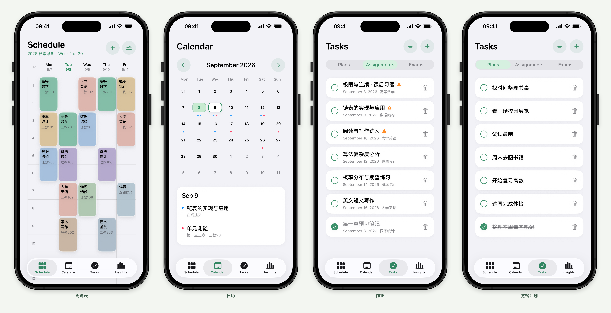
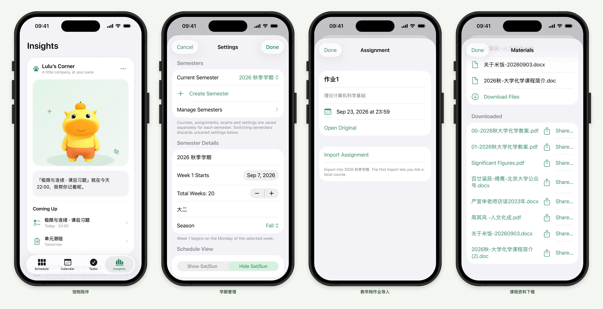
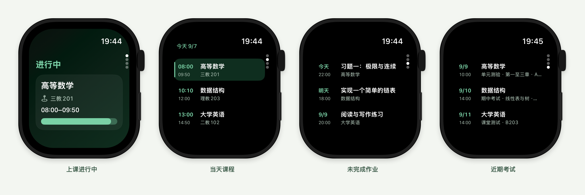

# Schedule

用 SwiftUI 和 SwiftData 开发的课程表应用，支持 iPhone / iPad（iOS 17.6+）。本分支同时提供 Apple Watch（watchOS 10.0+）只读配套应用。

| 版本 | 分支 |
| --- | --- |
| 仅手机版 | [`main`](https://github.com/aidenlee2005/Schedule-Public/tree/main) |
| 手机＋Apple Watch | [`codex/phone-watch`](https://github.com/aidenlee2005/Schedule-Public/tree/codex/phone-watch) |

**当前分支：`codex/phone-watch`。** 手机与手表一起构建、安装和续签。

## 功能

- 周课表、多上课时段、单双周、自定义课时与 CSV 导入。
- 在统一设置中创建、编辑和切换学期；各学期课程、作业与考试独立保存。
- 作业、考试与只需标题的宽松计划。
- Insights 中的 Lulu / Nai 宠物，通过触碰、动画和模板对白互动，不调用语言模型。
- 北大教学网官方网页登录、公告查看、作业导入与课程资料下载，需要使用者自己的账号。
- 手表四页：下一节课／进行中、自动日课表、最近 3 项未完成作业、未来 5 天考试。手表只同步和显示，没有编辑、完成、宠物或教学网操作。列表每屏完整显示三项，较长内容可点开查看详情。

## 安装准备

需要 Mac、完整 Xcode、Apple Account 和数据线。Xcode 的版本必须支持设备当前系统；首次打开时完成许可和平台组件安装。当前验证环境为 Xcode 26.6。免费 Personal Team 可用于自己的设备，无须购买开发者会员。

请安装 Xcode 的 **iOS 与 watchOS** 平台组件，并让 Apple Watch 与目标 iPhone 配对。

安装脚本使用 Xcode 自带的 `python3` 与 `devicectl`，不需要额外安装 Python 包。

## 首次配置

### 1. 下载本分支

```bash
git clone --branch codex/phone-watch --single-branch https://github.com/aidenlee2005/Schedule-Public.git Schedule-PhoneWatch
cd Schedule-PhoneWatch
```

### 2. 保存自己的签名身份

在 **Xcode → Settings → Accounts** 登录 Apple Account。以下本机文件保存安装用的 Team 和手机应用标识：

```text
~/Library/Application Support/ScheduleInstaller/Signing.json
```

打开它进行编辑：

```bash
mkdir -p "$HOME/Library/Application Support/ScheduleInstaller"
touch "$HOME/Library/Application Support/ScheduleInstaller/Signing.json"
open -e "$HOME/Library/Application Support/ScheduleInstaller/Signing.json"
```

首次使用时填写下面的内容，将示例值替换为自己的值；已有配置的用户保留原 Team 和应用标识：

```json
{
  "teamIdentifier": "YOURTEAMID",
  "bundleIdentifier": "com.yourname.Schedule"
}
```

`teamIdentifier` 是 10 位开发团队 ID。可以在 Xcode 为 Schedule target 选择自己的 Personal Team，再在 **Build Settings** 搜索 `DEVELOPMENT_TEAM` 查看。它不是 Apple Account 邮箱或证书 ID。

`bundleIdentifier` 是手机应用标识。首次安装使用自己的唯一值；已有数据时必须沿用原值，继续使用原数据容器。这个文件不需要任何账号密码。

保存后，在仓库目录运行：

```bash
xcrun python3 scripts/configure_xcode.py
open Schedule.xcodeproj
```

命令生成被 Git 忽略的 `Configuration/Signing.xcconfig.local`，Xcode 的 Debug / Release 配置会自动读取。以后换 Team 或应用标识时重新运行一次；只续签不必重复配置。若在 target 里手动填写过 Team，确认它与本机配置一致，或删除该项手动覆盖以恢复继承。不要单独修改 target 的 `PRODUCT_BUNDLE_IDENTIFIER`。

### 3. 连接设备

手机用数据线连接 Mac，解锁并信任电脑。在手机 **设置 → 隐私与安全性 → 开发者模式** 中开启该功能，按提示重启并确认。若暂时没有该选项，先在 **Xcode → Window → Devices and Simulators** 完成设备准备。

手表也需要在 **设置 → 隐私与安全性 → 开发者模式** 中启用开发者模式。若选项未出现，先让 Xcode 发现并准备已配对的手机与手表。手表佩戴并解锁，两端开启 Wi-Fi 和蓝牙，Mac 与手表保持可用的本地网络连接；手表无需通过充电线连接 Mac。

运行下面的命令查看设备列表：

```bash
./scripts/install_ios.sh --list-devices
```

将自己的手表标识补充到同一个 `Signing.json`，保留之前的两个值：

```json
{
  "teamIdentifier": "YOURTEAMID",
  "bundleIdentifier": "com.yourname.Schedule",
  "watchIdentifier": "设备列表中自己的手表标识"
}
```

手机和手表使用同一个 Team，手表应用标识由手机标识自动追加 `.watchkitapp`。只补充手表标识不需要重新生成 Xcode 配置。

## 安装与每周续签

**Mac 联网 → 手机插线 → 手机和手表解锁 → 双击根目录的 [Install.command](Install.command) → 等待两端安装完成 → 两端打开 Schedule。**

也可以在仓库目录运行：

```bash
./scripts/install_ios.sh
```

多台手机可连接时选择目标设备，或通过 `--device "你的 iPhone 名称"` 指定。脚本先构建并签名，再停止手机应用的后台进程、备份并校验数据、覆盖安装；首次启动前会核对数据库是否保留。备份期间不要打开手机上的 Schedule，安装完成后再断开连接。

**⌘B 只构建，不会安装。** 日常更新和续签请使用安装入口；直接在 Xcode 按 ⌘R 不经过脚本的备份检查。首次使用若提示不受信任开发者，按系统要求在手机 **设置 → 通用 → VPN 与设备管理** 中信任自己的开发者账号。

免费签名从签发起有效 7 天，以脚本输出的“签名到期”时间为准。Xcode 可能复用尚未过期的描述文件，每次安装不一定重新增加七天；到期后重新运行安装脚本，重复安装旧 `.app` 文件不会延长有效期。[Apple 官方说明](https://developer.apple.com/help/account/basics/about-your-developer-account)

只续签无需拉取源码。需要更新代码时，在仓库运行 `git pull --ff-only` 后再安装；有自己的代码改动时先妥善保留。不要卸载应用或更换应用标识来续签。

手机与手表各有签名到期时间，必须确认两端都安装成功。临时只更新手机可用 `./scripts/install_ios.sh --phone-only`；这不会续签手表，也不会移除本分支的 watchOS 构建依赖。

平时手机与手表的数据同步不需要 Mac。两端保持配对，分别打开 Schedule 可触发同步；后台传输由系统安排，手表离线时显示上次缓存。

## 数据与备份

首次打开是空白学期，应用不会填入演示课程。学期、课程、任务与设置保存在手机本地；更新沿用原 Team 和应用标识。手表只保存可重新同步的显示摘要。

每次安装的备份与日志位于仓库外：

```text
~/Library/Application Support/ScheduleInstaller/Installations/<时间-随机编号>/
```

`backup/` 包含手机的 `Library` 和 `Documents`，`installation.json` 记录安装结果。备份不含 Keychain 登录会话，需要时重新登录教学网。真实数据、个人签名和登录信息不应提交到 Git。

## 常见问题

| 情况 | 处理方式 |
| --- | --- |
| 双击安装入口打不开 | 在仓库终端运行 `bash scripts/install_ios.sh`。 |
| Xcode 提示 `requires a development team` | 检查本机 `Signing.json`，运行 `xcrun python3 scripts/configure_xcode.py`，确认 Xcode 登录了对应账号。 |
| 找不到设备 | 保持连接和解锁，在 Xcode 的 Devices and Simulators 中完成信任与设备准备。 |
| 界面没打开，却提示后台进程未停止 | 脚本会等待退出并处理挂起进程；若仍失败，停止 Xcode 调试，使用手表版时暂时退出手表上的 Schedule，再重试。 |
| 已安装但自动打开失败 | 解锁后手动打开 Schedule；手表的系统状态可能阻止自动离开表盘。 |
| 备份或数据库核对失败 | 保留本次日志与备份并排查，不要卸载、清空或用旧备份覆盖现有数据。 |
| 签名或账户配额错误 | 检查 Xcode 账号与联网情况，查看日志中 `error:` 附近内容。 |

## 第三方组件

教学网适配参考 PKU3b，HTML 解析使用 SwiftSoup。所需许可声明随应用保留在 [ThirdPartyNotices.txt](Schedule/TeachingNetwork/ThirdPartyNotices.txt)。
